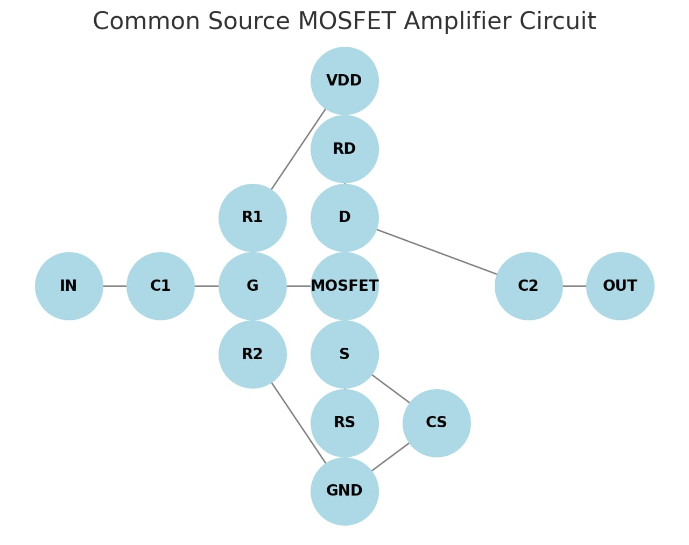

# TARA - AI-Powered Automatic Circuit Design

## Overview
TARA is an innovative AI-powered system that automates electronic circuit design, making it accessible to both experts and beginners. By leveraging advanced machine learning techniques and multi-agent systems, TARA transforms user requirements into optimized circuit designs without requiring deep expertise in circuit theory.


*TARA's user-friendly web interface*

## Problem Statement
Traditional circuit design is:
- Complex and time-consuming
- Requires expert knowledge
- Involves manual calculations
- Has a steep learning curve

TARA addresses these challenges through AI-driven automation that simplifies the design process while maintaining design integrity.

## Features
- **Automated Design**: Transform natural language requirements into functional circuit designs
- **Component Selection**: AI-driven selection of appropriate components based on requirements
- **Formula Retrieval**: Automatic application of relevant electrical formulas
- **Real-time Validation**: Circuit simulation and verification
- **Adaptive Optimization**: Iterative improvements to meet specified parameters

## How It Works
TARA employs a multi-agent AI system with the following specialized agents:

1. **Analyze Circuit Requirements**: Interprets and processes user specifications
2. **Select Appropriate Components**: Determines optimal components based on requirements
3. **Perform Small Signal Analysis**: Analyzes circuit behavior for AC signals
4. **Calculate Necessary Formulas**: Applies relevant electrical equations and principles
5. **Generate a Netlist**: Creates a text description of the circuit connectivity
6. **Convert Netlist to PySpice Code**: Transforms the netlist into simulation-ready code
7. **Simulate the Circuit**: Runs the circuit simulation to verify behavior
8. **Validate Performance**: Confirms the design meets the original requirements


*Multi-agent workflow showing how agents collaborate to design circuits*

### Example Workflow
```
User Input: "Design an amplifier circuit with a gain of 10 having input of 2V AC and 25V DC using resistors and capacitors."

AI Processing: 
- Determines requirements (gain=10, input=2V AC+25V DC)
- Selects appropriate amplifier topology
- Calculates component values (e.g., Rf = 9kΩ, Ri = 1kΩ, Cin = 0.1μF)
- Generates schematic
- Simulates performance
- Optimizes design if needed
```


*Example of a final optimized circuit generated by TARA*

## Tech Stack
- **AI Models**: DeepSeek, Gemini, OpenAI
- **Circuit Simulators**: NgSpice, LTSpice
- **Simulation Framework**: PySpice
- **Architecture**: RAG (Retrieval-Augmented Generation) implementation
- **System Design**: Multi-agent AI framework

## Innovative Aspects
- Automated formula retrieval using AI Agent
- Dynamic circuit optimization
- Iterative learning & self-improving designs
- Requirement-specific component selection

## Use Cases
- Quick prototyping for research and industrial applications
- AI-assisted learning for electronics beginners
- Adaptive designs based on specific requirements and constraints

## Future Work
- AI-driven PCB layout automation
- Integration with real-world component databases
- Advanced AI fault detection for circuits

## Team
- **Durga Rama Krishna Kapa** (Team Lead) - AI/ML Development
  - Contact: k.durgaramakrishna2005@gmail.com | 8790621879
- **Leela Prasad** - AI/ML Development
- **Lahari** - Frontend Development
- **Venu** - Backend Development


